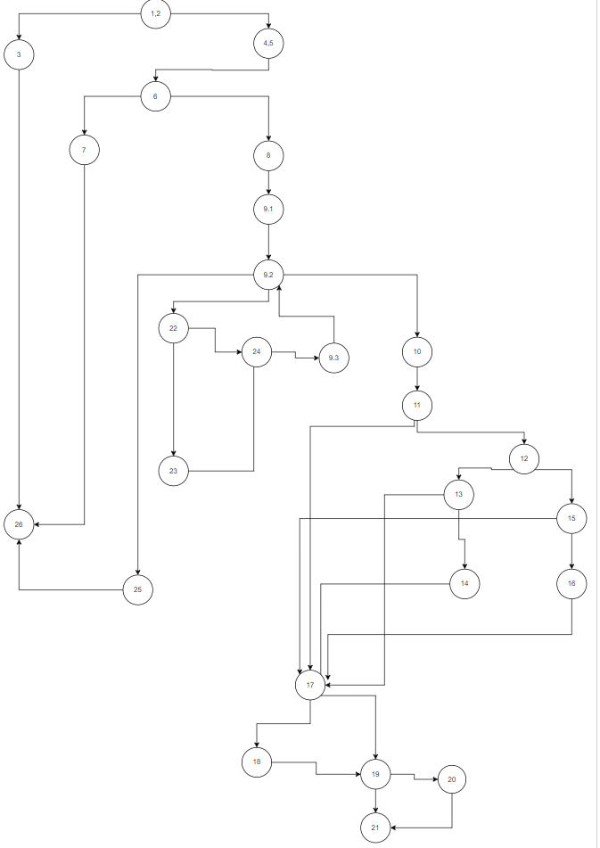
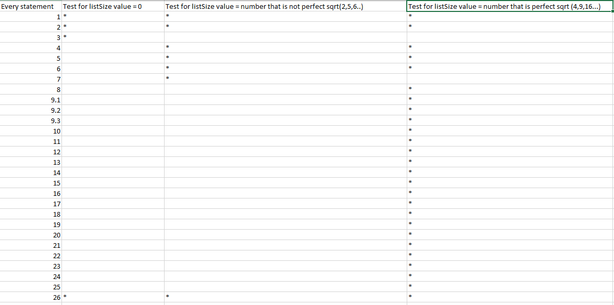
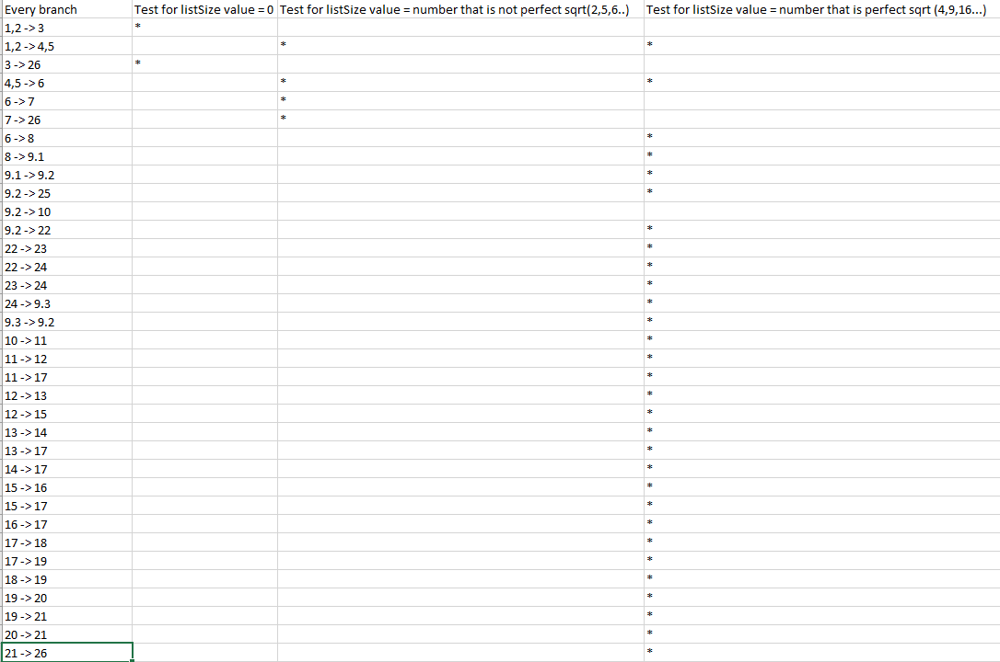

# SI_2022_lab2_203196

**Control Flow Graph**

**Цикломатска Комплексност**
Цикломатската комплексност ја преметувам т.ш.
го собирам вкупниот број на предикатни јазли (јазли кои се разгрануваат)
и го собирам со +1 - Односно бројот на предикатни јазли е 9 + 1 = 10.
Цикломатската комплексност изнесува 10.

**Every Statement**
Every State методата служи за да истестираме дали ни поминува кодот
во секој јазол кој го имам. За да го истестирам овај код потребни ми се 
3 тест примери за кодот да може точно да помине.

**Every Branch**
Every Branch методата служи за да го истестираме нажиот код во секоја гранка,
за гранка се смета растојанието од јазол А до јазол Б. Правиме онолку тестови
колку што ни се потребни за да нашиот код помине во сите гранки. Во овај код
потребни се 3 тест примери за да можеме да го тестираме целиот код.

**Unit Tests**

Во Unit тестовите прво тестирам Every statement criterium(служи за да истестираме дали ни поминува кодот
во секој јазол кој го има),
потоа тестирам Every branch criterium(служи за да го истестираме нашиот код во секоја гранка,
за гранка се смета растојанието од јазол А до јазол Б),
па Every path(за да ја изминам секоја патека на кодот кој го тестирам)
и на крајот Multiple conditions(овај тест се прави ако имаме if со повеќе услови).
Тестовите во Unit ѓи правев на сличен начин како што правев во Excel табелит. Одкако проверив 
колку тест примери ми се потребни за секоја метода на тестирање почнав да ги пишувам тестовите.
Тестовите во Unit се пишуваат со помош на посебни функции кои ни ги дава Unit. Пред секој тест
треба да поставимне посебна анотација @Test. Тестовите ѓи правев на начин така што прво пишував
коментар пред секој тест во кој правец треба да се движи тестот, апотоа ѓи пишеви тестовите.

